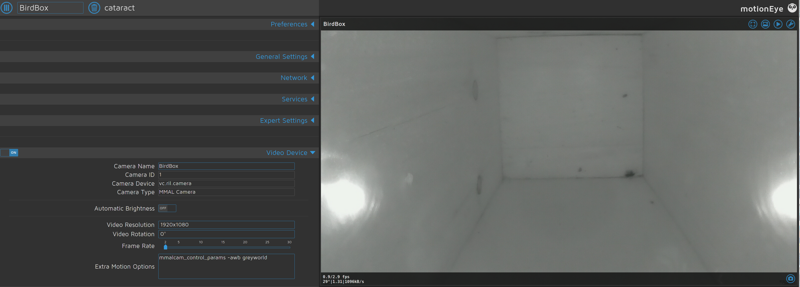
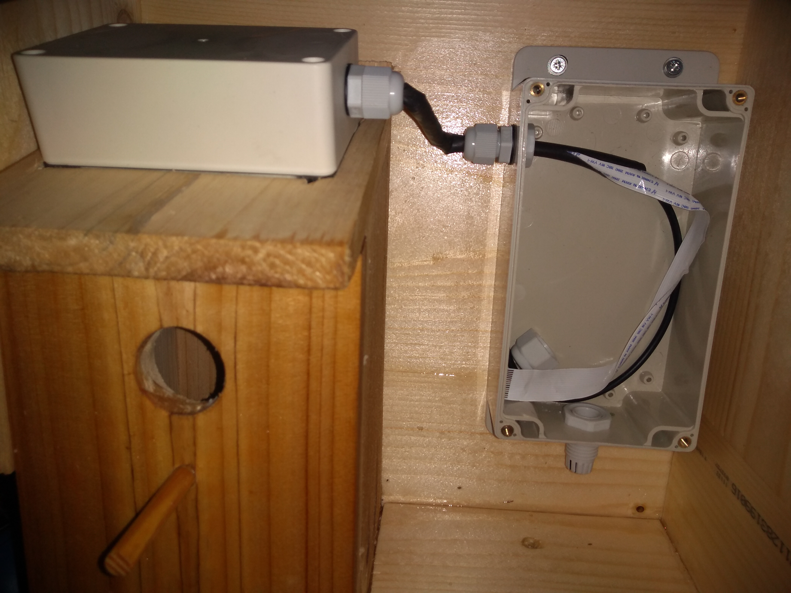
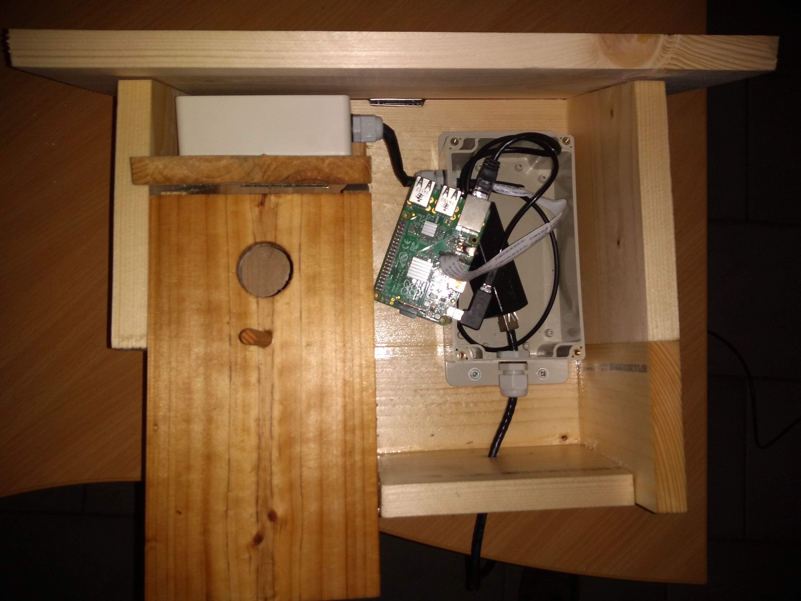

# Papageno

A Birdhouse monitored with a Raspberry Pi and MotionEye.

https://user-images.githubusercontent.com/2684865/122456725-295aae80-cfae-11eb-84d4-eb204cb23d59.mp4

https://user-images.githubusercontent.com/2684865/122456820-455e5000-cfae-11eb-99c5-24ab1c868ff9.mp4

## IR Cameras

Camera Night Vision 130° Fisheye Camera 5MP Webcam + 2 Infrared IR LED Lights

## Software

[MotionEyeOS](https://github.com/ccrisan/motioneyeos) is a nice operating system that provides a web interface on top of the linux [motion](https://linux.die.net/man/1/motion) daemon for motion detection configuration, camera setup, real time dashboard, ...

When movement is detected, some clever stuff can be done, currently it sends me a set of pictures by email.

## Putting it all together

Using heat shrink cable sleeve to connect the camera enclosure and the RPi enclosure. The CSI cable is wrapped around a round cable to have a tight fit so that the nut provides waterproof connection. Also, that cable could be used down the line to put some sensors in the camera enclosure.

## The camera enclosure at the top of the birdhouse

Hopefully the IR lights will not produce too much heat.

## Networking and power

I'm using a PoE Switch and an Micro USB Active PoE Splitter (48V to 5V 2.4A) to provide networking and power to the RPi

## And now we wait...

### False positive

> Motion has been detected by camera "BirdBox/cataract" at 2021-02-23 00:37:14 (Europe/Paris).

The famous Animalus gigantus tournesolus.
